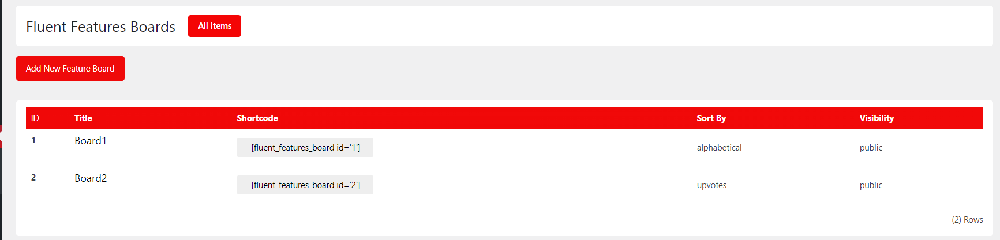
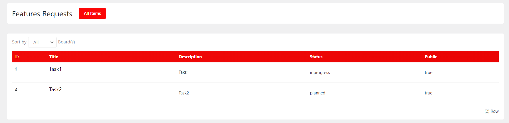

# Project Management

**Contributors:** Bipul Karmokar  
**Tags:** project management, tasks, productivity  
**Requires at least:** 5.0  
**Tested up to:** 5.7  
**Stable tag:** 1.0.0  
**License:** GPLv2  
**License URI:** https://www.gnu.org/licenses/gpl-2.0.html  

A plugin to manage projects and tasks within WordPress.

## Description

The Project Management/Task Management plugin helps you to manage your projects and tasks directly from your WordPress dashboard. It includes features such as project creation, task management, and tracking.

### Features

- Create and manage projects
- Add and assign tasks within projects
- Track project progress
- User-friendly admin interface

## Installation

1. Download the plugin zip file.
2. Go to your WordPress dashboard.
3. Navigate to Plugins > Add New.
4. Click on "Upload Plugin" and choose the downloaded zip file.
5. Click "Install Now" and then "Activate" the plugin.

## Usage

### Creating a Project

1. Navigate to the "Project Management" menu in the WordPress admin.
2. Click on "Add New Project".
3. Fill in the project details and save.

### Adding Tasks

1. Go to the project you want to add tasks to.
2. Click on "Add New Task".
3. Fill in the task details, assign to a user, and save.

### Shortcodes

- `[pm_project]` - Displays a list of tasks in an individual board.

## Screenshots

1. **Task List**  
   

2. **Feature List**  
   
